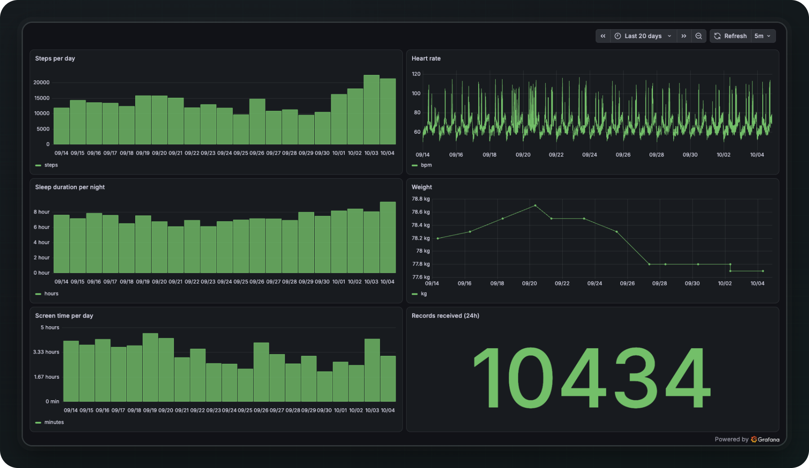
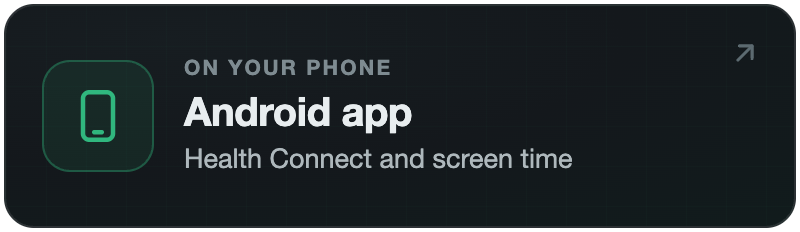
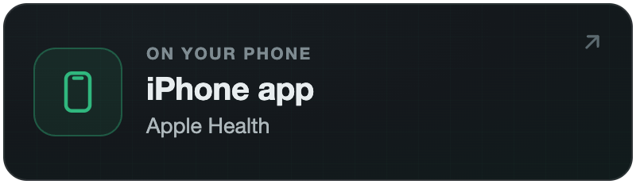
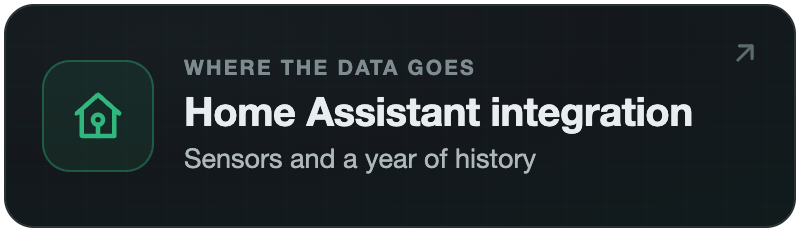
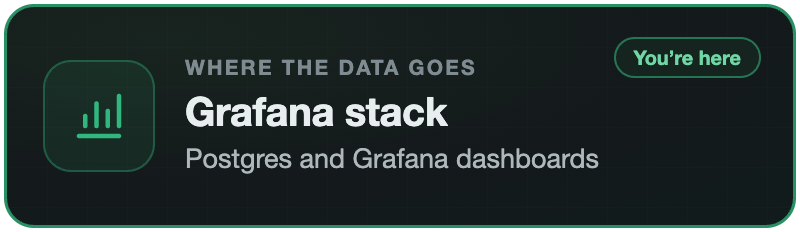

<p align="center">
  
</p>

<h1 align="center">Life Dashboard Stack</h1>

<p align="center">
  <b>Your phone's health data and screen time in your own Postgres and Grafana.</b><br>
  An example Docker Compose backend for the Life Dashboard Companion apps.
</p>

<p align="center">
  <a href="LICENSE"></a>
  <a href="docker-compose.yml"></a>
  <a href="https://www.postgresql.org/"></a>
  <a href="https://grafana.com/"></a>
</p>

<p align="center">
  <a href="#quick-start"><b>Quick start</b></a>
  &nbsp;·&nbsp;
  <a href="#how-data-is-stored">How&nbsp;data&nbsp;is&nbsp;stored</a>
  &nbsp;·&nbsp;
  <a href="https://github.com/owen282000/life-dashboard-companion-app/blob/main/docs/webhook.md">Payload&nbsp;reference</a>
  &nbsp;·&nbsp;
  <a href="https://github.com/owen282000/life-dashboard-companion-app">Android&nbsp;app</a>
  &nbsp;·&nbsp;
  <a href="https://github.com/owen282000/life-dashboard-companion-app-ios">iPhone&nbsp;app</a>
</p>

<p align="center">
  <picture>
    <source media="(max-width: 600px)" srcset="docs/readme-hero-phone.png">
    
  </picture>
</p>

[Life Dashboard Companion](https://github.com/owen282000/life-dashboard-companion-app) sends Health Connect data and screen time from an Android phone to any webhook, and its [iOS version](https://github.com/owen282000/life-dashboard-companion-app-ios) does the same with Apple Health data. This repository is the other end: one `docker compose up` starts a receiver, a database and a dashboard on your own machine. It's for people who want their records in SQL rather than in Home Assistant. Treat it as a starting point to change: it's offered as-is, not as a finished product.

## What you get

- **Receiver.** A small Python service on port 8080. It checks the `X-Signature` HMAC when you set a secret, and stores every record in Postgres. A record that arrives again, after a retry, a backfill or an edit on an Android phone, replaces the stored copy instead of adding a second one.
- **Postgres.** One `records` table with a JSONB column. All 33 record types of the Android app fit in it without schema changes. An iPhone sends 29 of them under the same keys: its 28 data types, with menstruation split into `menstruation_flow` and `menstruation_period`.
- **Grafana.** A provisioned dashboard on port 3000 with steps per day, heart rate, sleep per night, weight, screen time per day and the number of records received in the last 24 hours.

### Limits

It's an example, so it keeps things simple:

- Deletions aren't applied. A record deleted on the phone stays in the table (`deleted_records` is ignored). On an iPhone an edit is a deletion plus a new record, so the old version stays too.
- Series sent per time window are skipped. Leave **Data Resolution** on **Every record**, the default.
- The steps panel adds up raw step records. When a phone and a watch both write steps, it counts both. The `daily_totals` rows hold the figure without the double counting (see the query below).
- Records from every phone go into one table, and the dashboard doesn't split them by phone or person. Day records are kept once per date: with two Android phones or two iPhones, the `daily_totals` of the one that syncs last replace the other's. Screen time is kept per phone model.
- A day's `daily_totals` and screen time are replaced by whatever arrives last, not by the payload with the highest `sequence`. A payload that waited on the phone can put back an older figure until the next sync.
- The panels count days in UTC, not in your time zone, so a record near midnight can land on the day next to it.

## Part of Life Dashboard

Life Dashboard is four projects, and you only install the parts you need. Put the app on each phone, then pick where the data goes. Both apps send the same payload, so an Android phone and an iPhone can share one Home Assistant or one stack.

<p align="center">
  <a href="https://github.com/owen282000/life-dashboard-companion-app"></a>
  <a href="https://github.com/owen282000/life-dashboard-companion-app-ios"></a>
  <a href="https://github.com/owen282000/life-dashboard-ha"></a>
  <picture></picture>
</p>

The data can also go to an MQTT broker or a webhook of your own instead. Both apps have that built in, for n8n, Node-RED or a script.

## Quick start

You need Docker with Compose, and a phone on the same network as the machine that runs the stack.

```bash
git clone https://github.com/owen282000/life-dashboard-stack
cd life-dashboard-stack

# A signing secret and a Grafana password, kept in .env so every later "docker compose" uses them
echo "WEBHOOK_SECRET=$(openssl rand -hex 32)" > .env
echo "GRAFANA_PASSWORD=pick-a-password" >> .env
cat .env

docker compose up -d
```

Ports 8080 or 3000 already taken? Add `RECEIVER_PORT=18080` or `GRAFANA_PORT=13000` to `.env` and use those ports below.

The webhook URL is `http://<address of this machine>:8080/webhook`.

**Android** (Life Dashboard Companion 1.23.0):

1. On the **Health** tab, open **Webhook**. Add the URL under **Webhook URLs**, and paste the `WEBHOOK_SECRET` value into **HMAC signing secret (optional)**.
2. Under **Advanced**, switch on **Allow plain HTTP webhooks**. The app refuses `http://` addresses without it.
3. Tap **Test ping**, then **Save Changes**, then **Sync Now**.
4. For screen time, add the URL and the secret on the **Screen Time** tab too, then tap **Save Changes** and **Sync Now** there. That tab has its own URL list and its own secret, and **Allow plain HTTP webhooks** applies to both tabs.

**iPhone** (Life Dashboard Companion for iOS 1.6.0):

1. On the **Health** tab, open **Webhook**. Type the URL in the **Webhook URL** field and tap the plus button next to it.
2. Paste the `WEBHOOK_SECRET` value under **HMAC Signing Secret**.
3. Tap **Test ping**, then **Sync Now**. iOS asks once for access to the local network; allow it. Plain HTTP to an IP address works without a setting.

Then open Grafana at `http://<address of this machine>:3000`, log in as `admin` with your `GRAFANA_PASSWORD`, and open the **Life Dashboard** dashboard. It shows the last 7 days; pick a longer range in the time picker at the top right. A first sync sends the last 7 days of each type, and **Backfill** on the **Health** tab sends 30, 90 or 365 days.

To check that records arrive without Grafana:

```bash
docker compose exec db psql -U lifedash -c "SELECT type, count(*) FROM records GROUP BY type;"
```

## How data is stored

Every record is one row:

```sql
records(id bigserial, type text, ts timestamptz, uuid text UNIQUE, source_app text,
        payload_source text, received_at timestamptz, data jsonb)
```

- `type` is the key the record arrived under: `steps`, `heart_rate`, `sleep`, `screen_time`, `daily_totals` and so on.
- `ts` is the record's `time`, `end_time` or `session_end_time`. Day records (`daily_totals`, `screen_time`) only have a `date`, stored as midnight UTC.
- `uuid` is the record's own `uuid`, the key for replacing a record that comes again. Day records have none, so they're keyed on type, payload source, phone model (screen time only) and date, and the figure that arrives last for a day replaces the one before.
- `source_app` is the app that wrote the record on the phone, such as `com.garmin.android.apps.connectmobile`, or a name like `Owen's Apple Watch` from an iPhone.
- `payload_source` is the payload's `source`: `health_connect`, `screen_time` or `healthkit_ios`.
- `data` is the whole record as JSON. Read fields with `data->>'bpm'`, `data->>'kilograms'` and so on.

If you ran an older version of this stack, it stored day records under content hashes, a new row for every figure a day had. Remove those rows once:

```bash
docker compose exec db psql -U lifedash -c "DELETE FROM records WHERE type IN ('daily_totals', 'screen_time') AND uuid LIKE 'synthetic-%';"
```

The next sync sends recent days again under the new key: 7 days of screen time and the last few days of `daily_totals`. A **Backfill** on the **Health** tab sends older `daily_totals`. Screen time older than 7 days doesn't come back.

Steps per day without counting phone and watch twice:

```sql
SELECT data->>'date' AS day, (data->>'steps')::int AS steps
FROM records
WHERE type = 'daily_totals' AND payload_source = 'health_connect'
ORDER BY day DESC
LIMIT 7;
```

For an iPhone, use `healthkit_ios`.

Minutes per day in one app:

```sql
SELECT data->>'date' AS day, (app->>'minutes')::int AS minutes
FROM records, jsonb_array_elements(data->'apps') AS app
WHERE type = 'screen_time' AND app->>'name' = 'YouTube'
ORDER BY day DESC;
```

The Grafana data source is called **LifeDashboard Postgres**, so the same SQL works in a panel of your own. Every field of every type is in the Android app's [payload reference](https://github.com/owen282000/life-dashboard-companion-app/blob/main/docs/webhook.md), and the [JSON Schema](https://github.com/owen282000/life-dashboard-companion-app/blob/main/docs/webhook-schema.json) covers both apps. The [iOS payload page](https://github.com/owen282000/life-dashboard-companion-app-ios/blob/main/docs/webhook.md) lists where an iPhone differs.

## Security

- Set `WEBHOOK_SECRET`. With it, a request with a missing or wrong signature gets a 401 and nothing is stored; the app keeps that payload and sends it again once the secrets match. Without it, the receiver accepts unsigned posts from anyone who can reach it.
- The receiver speaks plain HTTP, and Docker publishes both the receiver and Grafana on every network interface of the host. Keep both on your own network. To reach the receiver from outside, put a reverse proxy with TLS (Caddy, Traefik, nginx) in front of it, use the `https://` address in the app, and allow request bodies of at least 10 MB in the proxy.
- `GRAFANA_PASSWORD` only takes effect on the first start, when Grafana creates its admin user. To change the password later, change it in Grafana.
- Postgres isn't published on a port. Its user and password are `lifedash`, set in `docker-compose.yml` (for the database and in the receiver's `DATABASE_URL`) and in `grafana/provisioning/datasources/postgres.yml`. If other people can reach the Docker host, change them in all three places before the first start: Postgres only reads them when it creates its database.

## Works with

- [Life Dashboard Companion](https://github.com/owen282000/life-dashboard-companion-app) for Android 1.23.0: Health Connect and Screen Time payloads.
- [Life Dashboard Companion for iOS](https://github.com/owen282000/life-dashboard-companion-app-ios) 1.6.0: Apple Health payloads.

Tested on Docker 29 with Postgres 16 and Grafana 13.2. The compose file pulls `grafana/grafana:latest`, so a later Grafana may look a little different.

## Help

Found a bug in the stack? Open an [issue](https://github.com/owen282000/life-dashboard-stack/issues) here. Questions about the apps go to the Android app's [Discussions](https://github.com/owen282000/life-dashboard-companion-app/discussions).

## License

MIT. See [LICENSE](LICENSE).
