<p align="center">
  
</p>

<h1 align="center">Life Dashboard Stack</h1>

<p align="center">
  <b>Your phone's health data and screen time in your own Postgres and Grafana.</b><br>
  The backend for the Life Dashboard apps: six Grafana dashboards and an MCP server with eight read-only tools for Claude or a local model. Docker Compose or Kubernetes, no cloud.
</p>

<p align="center">
  <a href="https://github.com/owen282000/life-dashboard-stack/releases/latest"></a>
  <a href="docker-compose.yml"></a>
  <a href="docs/kubernetes.md"></a>
  <a href="https://artifacthub.io/packages/search?repo=life-dashboard"></a>
  <a href="https://www.postgresql.org/"></a>
  <a href="https://grafana.com/"></a>
  <a href="docs/mcp.md"></a>
  <a href="LICENSE"></a>
</p>

<p align="center">
  <a href="#quick-start"><b>Quick&nbsp;start</b></a>
  &nbsp;·&nbsp;
  <a href="docs/install.md">Setup&nbsp;guide</a>
  &nbsp;·&nbsp;
  <a href="#dashboards">Dashboards</a>
  &nbsp;·&nbsp;
  <a href="docs/views.md">SQL&nbsp;views</a>
  &nbsp;·&nbsp;
  <a href="#ask-your-own-ai-mcp">MCP&nbsp;server</a>
  &nbsp;·&nbsp;
  <a href="docs/kubernetes.md">Kubernetes</a>
  &nbsp;·&nbsp;
  <a href="https://owen282000.com/life-dashboard/grafana/">Website</a>
</p>

<!-- life-dashboard:nav -->
<p align="center">
  <sub>Life Dashboard: <a href="https://github.com/owen282000/life-dashboard-companion-app">Android app</a> &nbsp;·&nbsp; <a href="https://github.com/owen282000/life-dashboard-companion-app-ios">iPhone app</a> &nbsp;·&nbsp; <a href="https://github.com/owen282000/life-dashboard-ha">Home Assistant integration</a> &nbsp;·&nbsp; <b>Grafana stack</b> &nbsp;·&nbsp; <a href="https://github.com/owen282000/life-dashboard-sleep-card">Sleep card</a> &nbsp;·&nbsp; <a href="https://github.com/owen282000/life-dashboard-screen-time-card">Screen time cards</a> &nbsp;·&nbsp; <a href="https://github.com/owen282000/life-dashboard-year-card">Year card</a> &nbsp;·&nbsp; <a href="https://github.com/owen282000/life-dashboard-activity-card">Activity card</a> &nbsp;·&nbsp; <a href="https://github.com/owen282000/life-dashboard-before-bed-card">Before bed card</a></sub>
</p>
<!-- /life-dashboard:nav -->

<p align="center">
  <picture>
    <source media="(max-width: 600px)" srcset="docs/readme-hero-phone.png">
    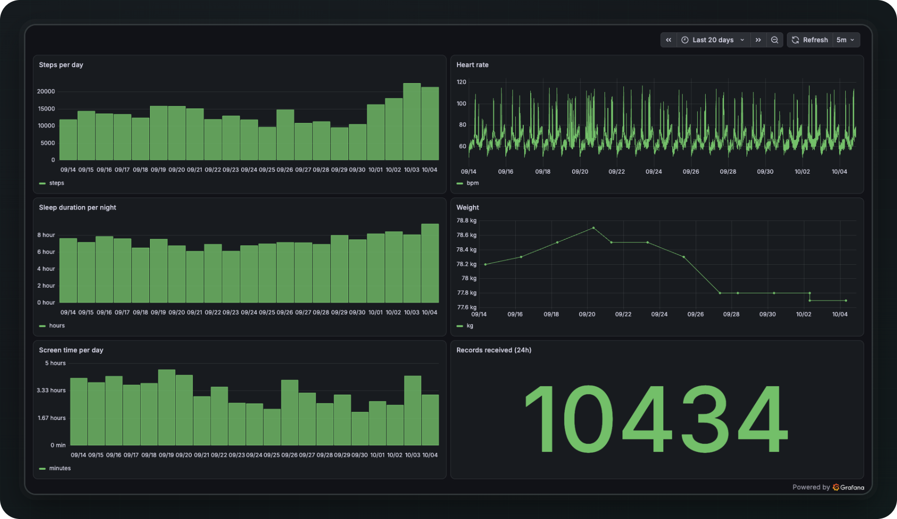
  </picture>
  <br><sub>Sample data. Tiles for steps today, last night's sleep, overnight low heart rate, weight, screen time and the last sync, the last 7 days against the 28 before, steps per day with a goal line, sleep stages per night and an hourly heart rate band.</sub>
</p>

The Life Dashboard apps send Health Connect data and screen time per app from an [Android phone](https://github.com/owen282000/life-dashboard-companion-app), or Apple Health from an [iPhone](https://github.com/owen282000/life-dashboard-companion-app-ios), to a webhook. This repository is the Grafana stack, the other end. One command starts a receiver that checks every signature, Postgres with your records in plain SQL, Grafana with six dashboards, and an optional MCP server so the AI you choose can answer questions about your own history.

- **Any brand, through the phone.** Whatever writes to Health Connect or Apple Health arrives, from every source at once, with no account and no cloud login per brand.
- **Android and iPhone in one database**, with screen time per app next to the health data.
- **Edits and deletions arrive too**, not only new records, so the database stays in step with the phone.
- **Stable within a major version.** The tables, views, API and MCP tools you build on stay as they are; [compatibility.md](docs/compatibility.md) lists them.

It's for people who want their records in a database they can query, next to Home Assistant or instead of it. With a local model nothing leaves your machine. It's a one-person project offered as-is and built to be changed: the views, the dashboards and the receiver are yours to adapt.

## What you get

- **Every record, checked and kept once.** The receiver checks the HMAC signature and stores every record in Postgres. A payload that arrives twice is applied once, a late one can't overwrite a newer one, and records you delete on the phone are deleted here too.
- **One table, plain SQL views.** All 34 record types of the Android app and the 28 of the iPhone app fit in one `records` table. The `dash` views turn them into days, nights, hours and apps in your time zone.
- **Six dashboards.** An overview as the home page, then Activity, Sleep, Heart and body, Screen time, and Data and sync. Grafana reads as a user that can only `SELECT`.
- **Ask your own AI.** An optional MCP server lets Claude, a local model in Ollama or any other MCP client answer questions such as "did I sleep better in the weeks I walked more?" from your own history, with read-only tools only. It stays off until you set a token.
- **Pairing with a QR code.** The receiver shows a code that the app scans, so you type neither the address nor the secret.
- **Every phone in your household.** Android phones and iPhones send to the same database, and each shows up as its own **Phone** in the dashboards.
- **Your data back out.** A read-only JSON API for scripts, widgets and home screens, off until you set a token.
- **Images, not a build.** Every part is an image on `ghcr.io` for amd64 and arm64 (so a Raspberry Pi with a 64-bit OS can run them), for Docker Compose or the Helm chart. Within a major version, nothing you build on changes.

<p align="center">
  <picture>
    <source media="(max-width: 600px)" srcset="docs/readme-screen-time-phone.png">
    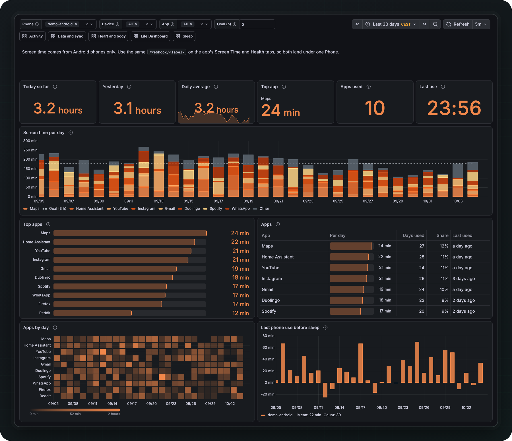
  </picture>
  <br><sub>Sample data. Minutes per app, per day, in a table you own, with the daily average, the top apps and how long before sleep the phone was last used.</sub>
</p>

## How it works

The phone pushes signed JSON to you. There's no cloud account in between, so there's no login that expires, no token to refresh and no API that changes under you.

<p align="center">
  <picture>
    <source media="(max-width: 600px)" srcset="docs/how-it-works-phone.png">
    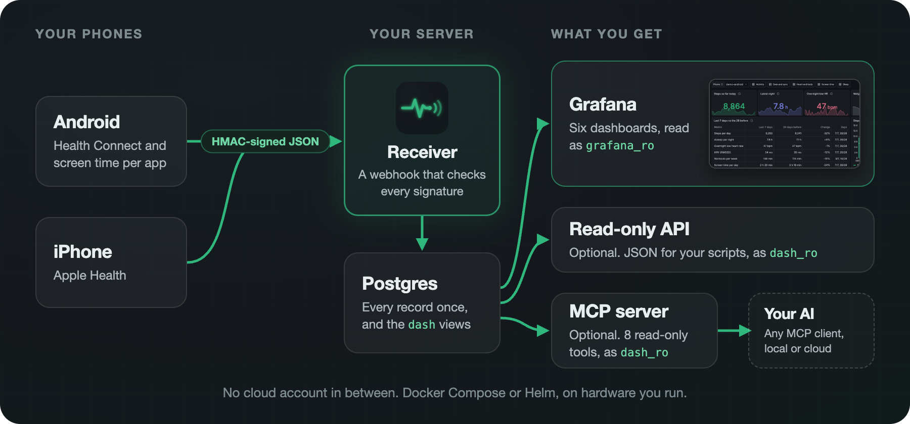
  </picture>
  <br><sub>The receiver checks every HMAC signature and writes each record once. Grafana reads the <code>dash</code> views as <code>grafana_ro</code>; the optional API and MCP server read them as <code>dash_ro</code>, and the MCP server gives the model you choose eight read-only tools.</sub>
</p>

[views.md](docs/views.md) explains how records become days and nights, and [compatibility.md](docs/compatibility.md) lists what stays the same within a major version.

## Part of Life Dashboard

Life Dashboard is two apps, three places for the data to go and a set of cards for Home Assistant, and you only install the parts you need. Put the app on each phone, then pick where the data goes. Both apps send the same payload, so an Android phone and an iPhone can share one Home Assistant, one stack or one server of your own.

On Android, [Google Play](https://play.google.com/store/apps/details?id=com.owen282000.lifedashboard&referrer=utm_source%3Dgh-stack-readme%26utm_medium%3Dreadme) is the easy way: €4.99 (US$4.99) once, with automatic updates, and it supports development. The same app stays free from [GitHub](https://github.com/owen282000/life-dashboard-companion-app/releases/latest), [Obtainium](https://apps.obtainium.imranr.dev/redirect?r=obtainium://add/https://github.com/owen282000/life-dashboard-companion-app) and [F-Droid](https://f-droid.org/packages/com.owen282000.lifedashboard/), with the same signature. On an iPhone, the app is on the [App Store](https://apps.apple.com/app/apple-store/id6824075761?pt=128699800&ct=gh-stack-readme&mt=8) for €6.99 (US$5.99) once.

<p align="center">
  <b>Start here: the app on your phone</b><br>
  <a href="https://github.com/owen282000/life-dashboard-companion-app"><picture><source media="(prefers-color-scheme: light)" srcset="docs/family/android-light.png">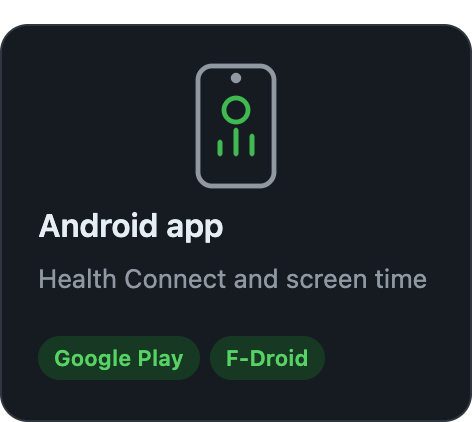</picture></a>
  <a href="https://github.com/owen282000/life-dashboard-companion-app-ios"><picture><source media="(prefers-color-scheme: light)" srcset="docs/family/ios-light.png">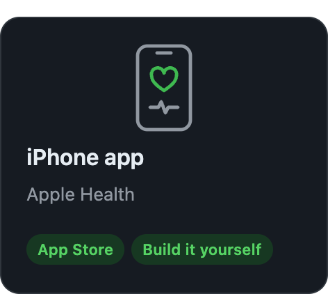</picture></a>
</p>

<p align="center">
  <picture><source media="(prefers-color-scheme: light)" srcset="docs/family/arrow-light.png"></picture><br>
  <sub>sends your data to</sub>
</p>

<p align="center">
  <b>Where the data goes</b><br>
  <picture><source media="(prefers-color-scheme: light)" srcset="docs/family/stack-here-light.png">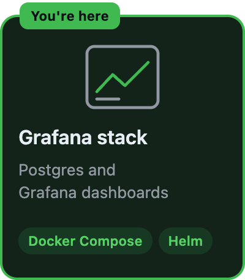</picture>
  <a href="https://github.com/owen282000/life-dashboard-ha"><picture><source media="(prefers-color-scheme: light)" srcset="docs/family/ha-light.png"></picture></a>
  <a href="https://owen282000.com/life-dashboard/health-connect-webhook/"><picture><source media="(prefers-color-scheme: light)" srcset="docs/family/own-server-light.png">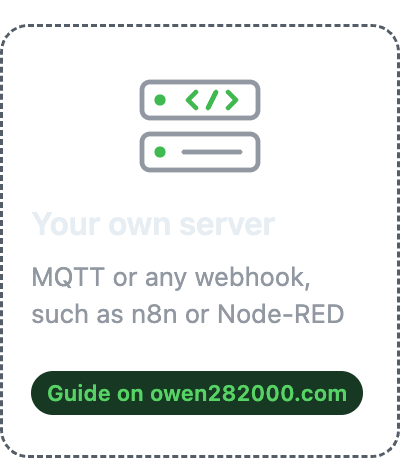</picture></a>
</p>

<p align="center">
  <picture><source media="(prefers-color-scheme: light)" srcset="docs/family/arrow-light.png"></picture>
</p>

<p align="center">
  <b>Cards for your Home Assistant dashboard</b><br>
  <sub>They need Home Assistant; most work with any sensor, and the integration fills them with your history.</sub><br>
  <a href="https://github.com/owen282000/life-dashboard-sleep-card"><picture><source media="(prefers-color-scheme: light)" srcset="docs/family/sleep-card-light.png"></picture></a>
  <a href="https://github.com/owen282000/life-dashboard-screen-time-card"><picture><source media="(prefers-color-scheme: light)" srcset="docs/family/screen-time-card-light.png">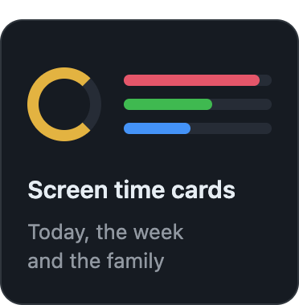</picture></a>
  <a href="https://github.com/owen282000/life-dashboard-year-card"><picture><source media="(prefers-color-scheme: light)" srcset="docs/family/year-card-light.png">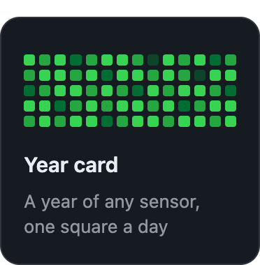</picture></a>
  <a href="https://github.com/owen282000/life-dashboard-activity-card"><picture><source media="(prefers-color-scheme: light)" srcset="docs/family/activity-card-light.png">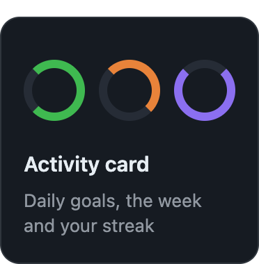</picture></a>
  <a href="https://github.com/owen282000/life-dashboard-before-bed-card"><picture><source media="(prefers-color-scheme: light)" srcset="docs/family/before-bed-card-light.png">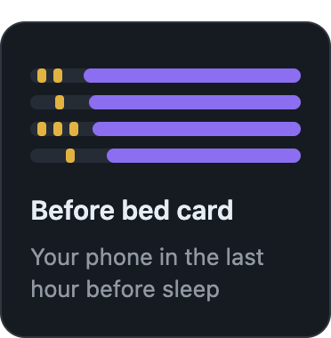</picture></a>
</p>

## Quick start

What you need:

- **A machine for the stack**: Docker with Compose 2.20 or newer, or Podman 4.7 or newer, on a machine your phone can reach (the same network, or a VPN).
- **A phone**: Android 9 or newer with Health Connect (Android 8.0 is enough for screen time alone), or an iPhone on iOS 17 or newer. Pairing with a QR code needs the Android app 1.16.0 or the iPhone app 1.4.0 or newer.
- **Something that fills it**: your watch or fitness app must write to Health Connect or Apple Health. The app sends what is in there.
- **No Home Assistant**: the app sends straight to the stack. If you run Home Assistant too, the same app can send to both.

<a id="pair-the-app"></a>

1. **Run the installer.** It puts the release files in `./life-dashboard`, writes `.env` with a random secret and passwords, starts the stack and shows the pairing code:

   ```bash
   curl -fsSL https://github.com/owen282000/life-dashboard-stack/releases/latest/download/install.sh | sh
   ```

   Prefer to read it first? Download it, read it, then run it:

   ```bash
   curl -fsSLO https://github.com/owen282000/life-dashboard-stack/releases/latest/download/install.sh
   less install.sh
   sh install.sh
   ```

2. **Install the app.** It's listed on Google Play and the App Store as Health Data for Home Assistant: [Google Play](https://play.google.com/store/apps/details?id=com.owen282000.lifedashboard&referrer=utm_source%3Dgh-stack-readme%26utm_medium%3Dreadme) for €4.99 (US$4.99) once, the [App Store](https://apps.apple.com/app/apple-store/id6824075761?pt=128699800&ct=gh-stack-readme&mt=8) for €6.99 (US$5.99) once. On Android the APK from [GitHub](https://github.com/owen282000/life-dashboard-companion-app/releases/latest) and [F-Droid](https://f-droid.org/packages/com.owen282000.lifedashboard/) is free, and the iPhone app can be [built from source](https://github.com/owen282000/life-dashboard-companion-app-ios#build-and-install).
3. **Pick the stack as the destination.** Open the app and, at the setup question about where your data should go, tap **Scan a pairing code**. Scan the code in your terminal and tap **Pair**. Did you already finish the setup, or skip the code with **I will set this up later**? Then the same button is on the **Health** tab: right on the tab while it has no destination, and under **Add destination** once it has one.
4. **Grant permissions.** On Android, allow Health Connect and, for screen time, usage access. On an iPhone, allow Apple Health access.
5. **Tap Sync Now**, on Android on both the **Health** and the **Screen Time** tab.
6. **Send your history.** Under **What to send**, tap **Send history** and pick 90 days to fill the dashboards with the last three months.
7. **Open Grafana** on port 3000 and log in as `admin` with `GRAFANA_PASSWORD` from `life-dashboard/.env`. The overview is the home page.

You should now see the overview with today's steps, last night's sleep and the time of the last sync, and your phone in the **Phone** picker at the top. Still empty? These are the usual reasons:

- **The phone can't reach the machine.** Open `http://<address of this machine>:8080/health` in the phone's browser, on the network it syncs from. An iPhone also refuses plain `http://` to a name such as `nas.lan`: use the IP address or `https://`.
- **Nothing was sent yet.** A data type that is off or has no permission sends nothing, and so does a phone where no watch or fitness app writes to Health Connect or Apple Health. The **Data and sync** dashboard shows what arrived, and from which phone.
- **Only a few days show.** The first sync sends the last 7 days; the rest comes with **Send history**.

The same installer line with `-s -- doctor` checks the install and says what to fix. The [setup guide](docs/install.md) has the installer's options, the [install by hand](docs/install.md#by-hand), [a NAS or Portainer](docs/install.md#on-a-nas-or-in-portainer), [Podman](docs/install.md#podman), the [pairing code](docs/install.md#pair-the-app), [setting a phone up by hand](docs/install.md#connect-a-phone-by-hand) and [several phones](docs/install.md#several-phones).

**How much room it takes.** With a year of sample data for two phones (235,000 records), the stack used about 450 MB of memory while every dashboard loaded, 520 MB with the MCP server, and 530 MB on disk: 210 MB of data and 320 MB of Postgres write-ahead log. The images are about 650 MB to download, most of it Grafana.

## Try it without a phone

The `demo` profile posts 60 days of made-up data for an Android phone and an iPhone through the real receiver. Run it in a folder of its own, under its own project name and ports, so it never touches your own data:

```bash
mkdir lifedash-demo && cd lifedash-demo
curl -fsSLO https://github.com/owen282000/life-dashboard-stack/releases/latest/download/docker-compose.yml
printf '%s\n' "WEBHOOK_SECRET=$(openssl rand -hex 32)" GRAFANA_PASSWORD=demo-admin \
  GRAFANA_DB_PASSWORD=demo-ro DASH_DB_PASSWORD=demo-dash RECEIVER_PORT=18080 GRAFANA_PORT=13000 > .env
docker compose -p lifedash-demo --profile demo up -d
```

Then open `http://localhost:13000` and log in as `admin` with the password `demo-admin`. A new stack starts only with a secret and passwords of its own, so the `.env` line gives the demo its own. [Try it without a phone](docs/install.md#try-it-without-a-phone) has the full steps and how to remove it again. To try the MCP server on the same made-up data, put `MCP_TOKEN=$(openssl rand -hex 32)` in front of the command and add `--profile mcp`, then connect your MCP client to `http://localhost:8090/mcp` with that token.

## Dashboards

Every dashboard has a **Phone** picker at the top, and every panel an info icon that says where its figure comes from.

| | Dashboard | What it answers |
|---|---|---|
| 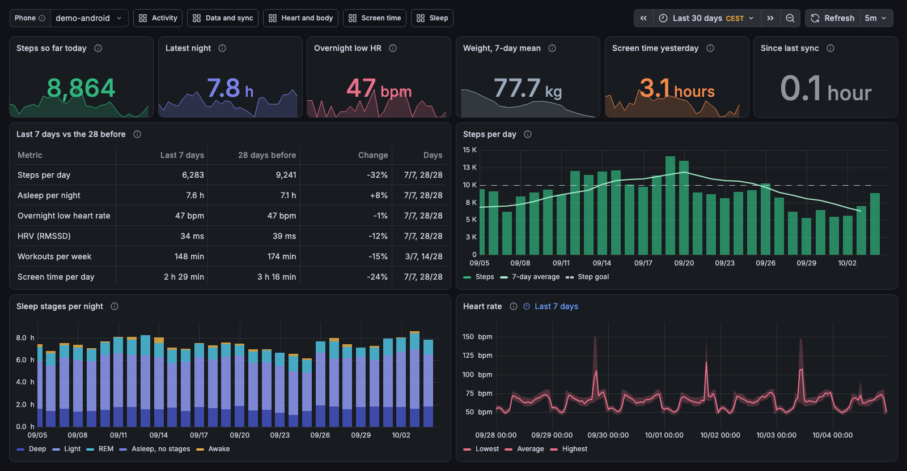 | **Life Dashboard** (overview, home) | How were today and last night, and how does this week compare with the four before it? |
| 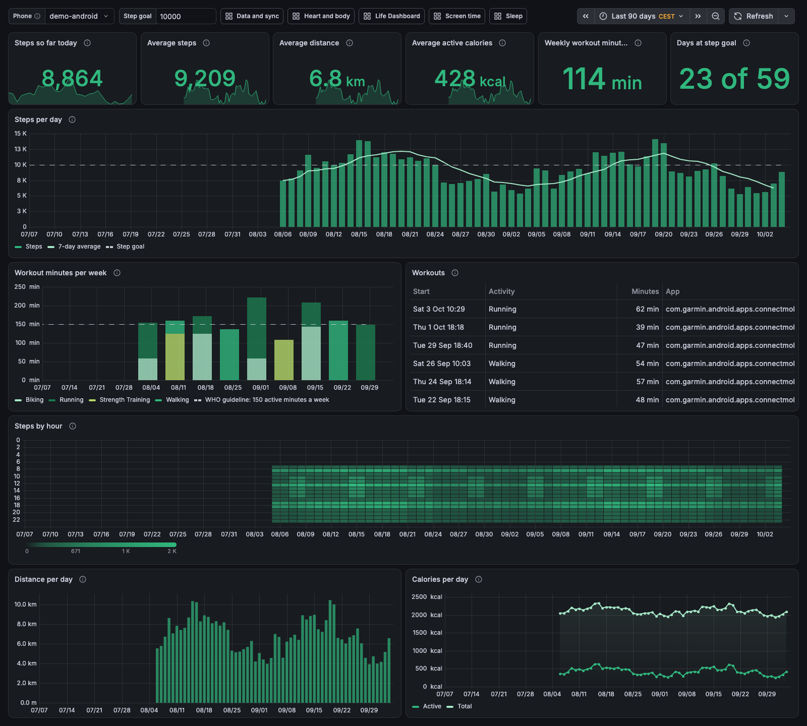 | **Activity** | Steps, distance and calories per day, steps by hour, and workout minutes per week next to the WHO guideline of 150. |
| 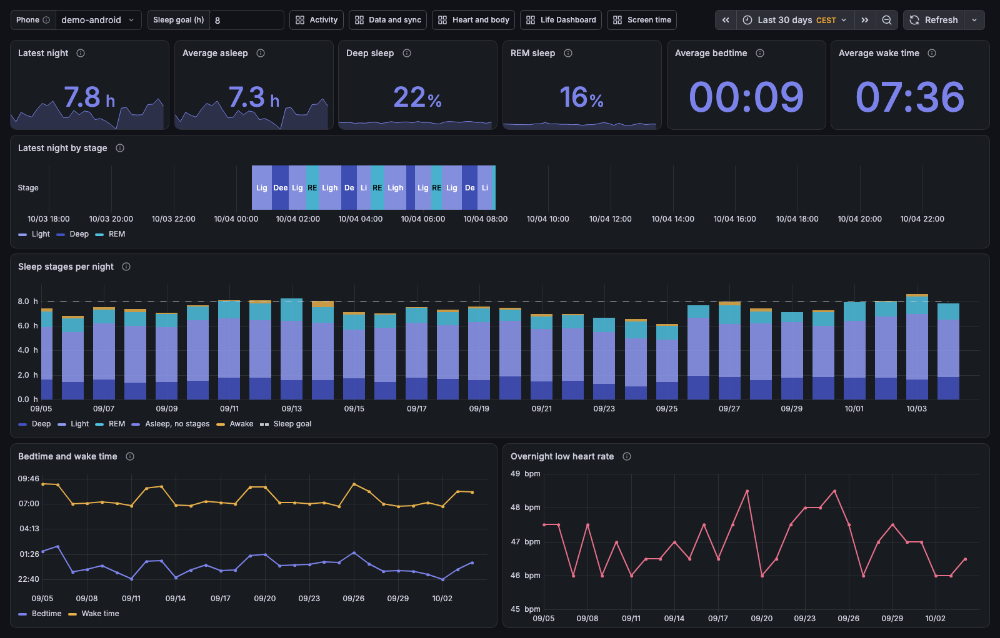 | **Sleep** | Last night as a hypnogram, stages per night, bedtime and wake time, and the overnight low heart rate. |
| 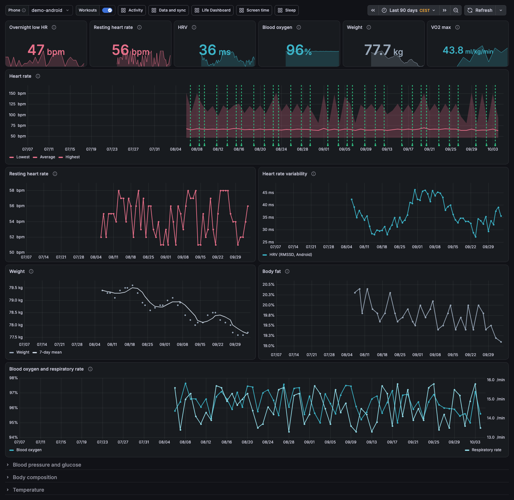 | **Heart and body** | Heart rate per hour, resting heart rate, HRV, SpO2, breathing rate and weight with its 7-day mean. Blood pressure, glucose, body composition and temperature sit in folded rows. |
| 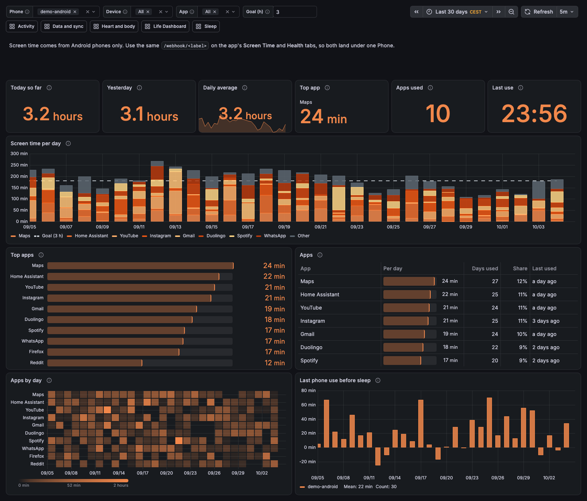 | **Screen time** | Minutes per day and per app, the top apps, and how long before sleep the phone was last used. Android only. |
| 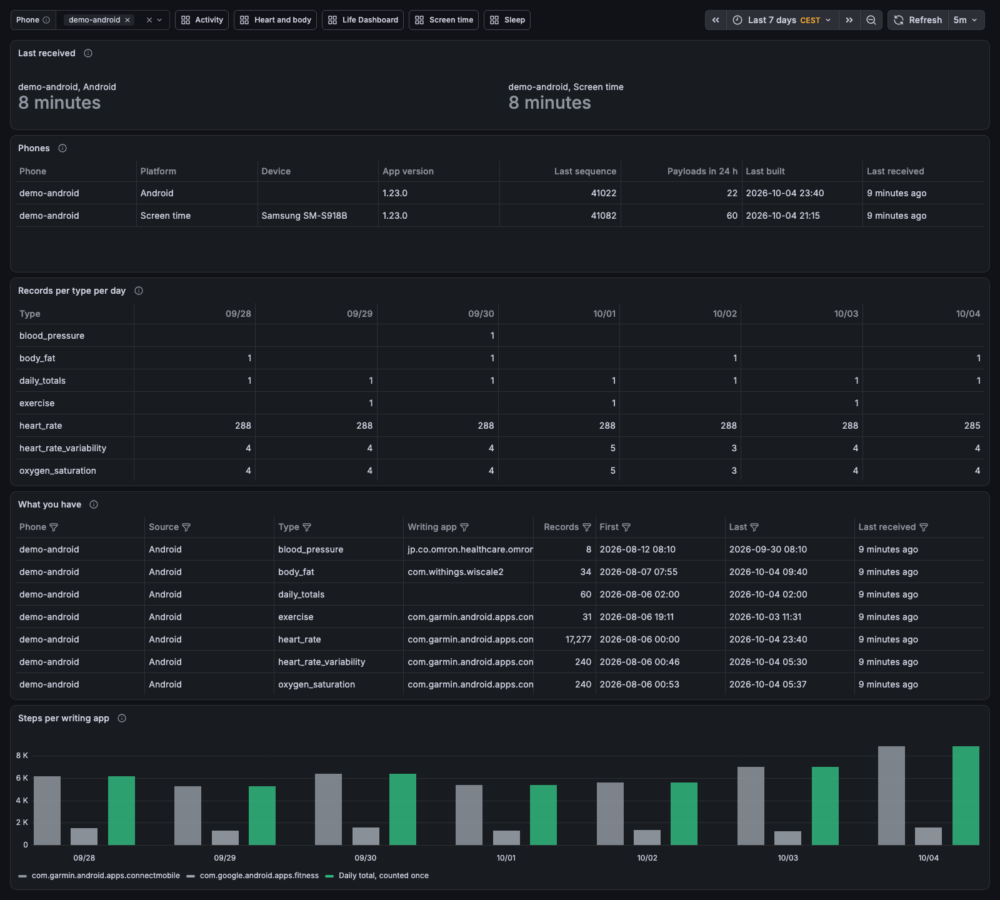 | **Data and sync** | When each phone last sent data, which types you have, how many records arrive per day, and why raw step records count a walk twice. |

Days are local days in your time zone, a missing day is a gap rather than a zero, and nothing is scored as good or bad. [The dashboards](docs/install.md#the-dashboards) lists the rules behind every panel and how to make a copy of your own.

## Ask your own AI (MCP)

[MCP](https://modelcontextprotocol.io) is the standard way for an AI model to call tools. The Grafana stack's optional MCP server gives the model you choose eight read-only tools on your history: `list_phones`, `data_catalog`, `sync_status`, `daily_summary`, `sleep_nights`, `workouts`, `trend` and `screen_time`. None of them writes or takes SQL, and the server reads as `dash_ro`, a user that can only read the `dash` views.

```bash
echo "MCP_TOKEN=$(openssl rand -hex 32)" >> .env
echo "COMPOSE_PROFILES=mcp" >> .env
docker compose up -d
```

Connect any MCP client to `http://<this machine>:8090/mcp` with the token, or let Claude Desktop start it over stdio. Then ask things like "how did my sleep change in the weeks I ran more?" or "which apps took most of my screen time last Sunday?".

The stack sends nothing to any AI by itself: with a local model everything stays on your hardware, and with a cloud model your questions and the results go to that provider. [mcp.md](docs/mcp.md) has the setup for Claude Desktop, Open WebUI, LM Studio and a local model through Ollama, and the Helm chart runs the same server with `mcp.enabled: true`.

## Write your own query

The `dash` views hold one row per day, night, hour or app, with local days already worked out:

```sql
-- Steps per day, counted once, for the phone labeled "pixel"
SELECT day, steps FROM dash.activity_days WHERE install = 'pixel' ORDER BY day DESC LIMIT 7;

-- Minutes per day in one app
SELECT day, minutes FROM dash.screen_apps WHERE app = 'YouTube' ORDER BY day DESC;

-- Last night's sleep
SELECT day, asleep_h, deep_h, rem_h FROM dash.sleep_nights ORDER BY day DESC LIMIT 1;
```

Run them with `docker compose exec db psql -U lifedash`, or in a Grafana panel of your own with the **LifeDashboard Postgres** data source. [views.md](docs/views.md) lists every view, column and unit, and where to keep views of your own. The raw records are in `records`, as sent: the Android app's [payload reference](https://github.com/owen282000/life-dashboard-companion-app/blob/main/docs/webhook.md) has every field, and the [iOS payload page](https://github.com/owen282000/life-dashboard-companion-app-ios/blob/main/docs/webhook.md) lists where an iPhone differs.

## Read your data back

Set `API_TOKEN` and the receiver also answers a read-only JSON API under `/api/`: the phones, totals per day, nights, workouts, screen time, one metric per day, and a trend. [api.md](docs/api.md) lists every endpoint with an example.

## Kubernetes

A Helm chart runs the same images on a cluster of your own, with Postgres through [CloudNativePG](https://cloudnative-pg.io) for replicas, failover and backups, as one bundled pod, or on a Postgres you already have. [kubernetes.md](docs/kubernetes.md) covers installing, pairing, routes, backups, upgrades and GitOps.

## Upgrading

Installed with the one-line installer? Run the same line with `--upgrade`, pointed at your install folder:

```bash
curl -fsSL https://github.com/owen282000/life-dashboard-stack/releases/latest/download/install.sh | sh -s -- --upgrade --dir ~/life-dashboard
```

It keeps your `.env` (the secret, the passwords, the ports and the tokens), saves the old `docker-compose.yml` as `docker-compose.yml.<old version>.bak` next to the new one, leaves a `docker-compose.override.yml` alone, pulls the images and restarts. Your data and your own Grafana dashboards stay. It never goes back to an older version. Run `sh install.sh doctor --dir ~/life-dashboard` afterwards to check it.

Running Docker Compose by hand? Set `LIFEDASH_VERSION` in `.env` to a newer release, or to `1` to follow every 1.x release, then run `docker compose pull && docker compose up -d`. Changes of your own go in `docker-compose.override.yml`, never in `docker-compose.yml`, so an upgrade can't undo them. [Upgrading](docs/operations.md#upgrading) has the details. Coming from a version before 1.0.0, which ran Postgres 16? The database won't start until one script moves your data over: see [Upgrading from a version before 1.0.0](docs/operations.md#upgrading-from-a-version-before-100). A backup is one line: `docker compose exec -T db pg_dump -U lifedash -Fc lifedash > lifedash-$(date +%F).dump`. [Backups](docs/operations.md#backups) covers restoring.

Tested on Docker 29 with Postgres 18.6 and Grafana 13.3.1. Versions are pinned in the images, Dependabot proposes updates, and each release publishes them as new images.

## Exposing it safely

Set `WEBHOOK_SECRET`, so only your phones can send data. The receiver speaks plain HTTP, `/pair` shows the secret, and anyone who can open Grafana can read every record, so put a reverse proxy with TLS in front of the receiver only and keep Grafana on your own network or a VPN. [Exposing it safely](docs/operations.md#exposing-it-safely) covers every point, from the pairing page behind a proxy to the database passwords.

## Known gaps

Series the Android app sends per time window are stored, but only the heart rate panels read them so far, so leave **Data Resolution** on **Every record**, the default. [Known gaps](docs/operations.md#known-gaps) lists the rest.

## Documentation

**Get started:** [Setup guide](docs/install.md) · [Try it without a phone](docs/install.md#try-it-without-a-phone) · [Kubernetes](docs/kubernetes.md)

**Reference:** [SQL views](docs/views.md) · [API](docs/api.md) · [MCP server](docs/mcp.md) · [What a version keeps stable](docs/compatibility.md) · [Helm chart](charts/life-dashboard/README.md)

**Project:** [Upgrades, backups and security](docs/operations.md) · [Build from source](docs/operations.md#build-from-source) · [Changelog](CHANGELOG.md) · [Releasing](docs/releasing.md) · [Security policy](SECURITY.md)

<!-- life-dashboard:built -->
## How this is built

Life Dashboard is a one-person project, and [Claude Code](https://claude.com/claude-code) writes a large part of the code. I decide what gets built, read every change before it is merged, and test it on my own phones and Home Assistant before a release. Automated checks run on every pull request, and the [AI policy](https://github.com/owen282000/life-dashboard-companion-app/blob/main/AI_POLICY.md) explains what the AI does and what I check.
<!-- /life-dashboard:built -->

<a id="build-from-source"></a>

## Help and contributing

Found a bug in the Grafana stack? Open an [issue](https://github.com/owen282000/life-dashboard-stack/issues) here. Questions about the apps go to the Android app's [Discussions](https://github.com/owen282000/life-dashboard-companion-app/discussions). No GitHub account? Use the [feedback board](https://owen282000.com/life-dashboard/feedback/), which needs no account. Everything on it is public, so leave out health data, logs and webhook URLs.

Pull requests are welcome. The receiver and the MCP server are Python, the views SQL, and [Build from source](docs/operations.md#build-from-source) builds the images from a clone and runs the tests.

## Support the project

Stars, shares and good bug reports all help. This is a one-person project, but your setup doesn't depend on that person: there's no server of mine to switch off, your history lives in your own database, and the code is MIT. If you want to chip in for the evenings that go into it, there's [Ko-fi](https://ko-fi.com/owen282000). The Grafana stack stays free and open source either way.

MIT licensed. See [LICENSE](LICENSE).

<!-- life-dashboard:footer -->
<p align="center">
  <sub>Made by <a href="https://github.com/owen282000">Owen Vogelaar</a> for the self-hosting and quantified self crowd.</sub><br>
  <sub>Google Play and the Google Play logo are trademarks of Google LLC.</sub><br>
  <sub>Apple, the Apple logo and App Store are trademarks of Apple Inc.</sub>
</p>
<!-- /life-dashboard:footer -->
